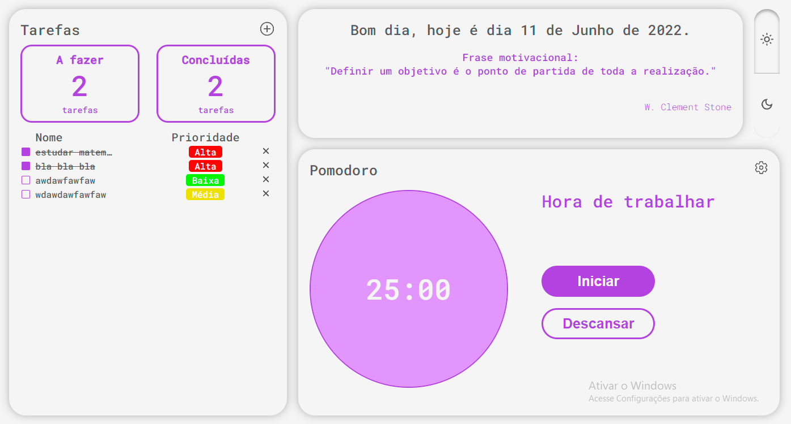

# POMO TASK

## Tecnologias utilizadas
- ReactJS
- TypeScript
- Styled Components

## Funcionalidades
- ### Lista de tarefas
    Ele possui uma lista de tarefas, nessa lista você pode adicionar, remover tarefas, conclui-lás, filtrar pelas completas ou a fazer, além disso as tarefas tem uma propriedade chamada prioridade, nela é possivel definir a prioridade da tarefa, sejá ela alta, média ou baixa.
- ### Pomodoro
    Outra funcionalidade é o pomodoro, nele é possivel definir um tempo para trabalhar e um tempo para descansar, quando o tempo acaba e você está em outra pagina do navegador, ou em outro programa no computador, você será notificado que o tempo de trabalho ou descanso acabou.
- ### Mensagem motivacional
    Ele também possui um sistema de frases motivacionais, todos os dias uma frase do arquivo "dailyMessages.json" vai ser escolhida e mostrada na tela.
- ### Tema
    Por fim, o projeto também possui um sistema de temas claro e escuro, que pode ser mudado pressionando um botão que fica no canto superior direito no computador e na parte inferior em celulares

## Quer testar o projeto no seu pc?
Se quiser testar o projeto na sua maquina local é so seguir os comandos abaixo. 
1° `git clone https://github.com/mayron1806/pomo-task`  
2° `cd pomo-task` 
3° `npm install` ou `yarn` 
4° `npm start` ou `yarn start` 
5° Acesse a url `http://localhost:3000` no navegador.  

(Obs.: é necessario ter o node instalado no seu computador.)

## Versão desktop
Este projeto também possui uma versão para windows, que pode ser usada offline, caso queira usar o app no seu pc é so acessar o link abaixo.  
Arquivos do app no Google drive (Windows): https://drive.google.com/file/d/14fbAfvqqV2tsd6fcjR5473PXPSzODAJL/view?usp=sharing  
Repositório: https://github.com/mayron1806/Taskpomo-desktop